# Projeto gerenciador de finanças pessoal.

Criação de uma API Rest para gerenciamento de finanças.

## 🚀 Principais Tecnologias
- **Java 17**
- **Spring Boot 3**
- **Spring Data JPA**
- **OpenAPI (Swagger)**
- **Lombok**
- **PostgreSQL**
- **Railway**

## Variáveis de Ambiente

Para rodar esse projeto, você vai precisar adicionar as seguintes variáveis de ambiente.

- `SPRING_PROFILES_ACTIVE` **'HML' ou 'PROD'**
- `PGHOST`
- `PGPORT`
- `PGDATABASE`
- `PGUSER`
- `PGPASSWORD`

# Diagrama

```mermaid
classDiagram
    direction LR

    class User {
        +Long id
        +String username
        +String password
        +List~Role~ roles
        +List~Account~ accounts
    }

    class Role {
        +Long id
        +String name
    }

    class Account {
        +Long id
        +String accountName
        +Double balance
        +List~User~ users
        +List~Transaction~ transactions
    }

    class PaymentType {
        +Long id
        +String name
        +String description
    }

    class Transaction {
        +Long id
        +Double amount
        +LocalDate transactionDate
        +int installmentNumber
        +int totalInstallments
        +Account account
        +PaymentType paymentType
    }

    %% Associações e relações
    User "1" --> "N" Role
    Account "1" --> "N" User
    Account "1" --> "N" Transaction
    Transaction "1" --> "1" PaymentType
```

